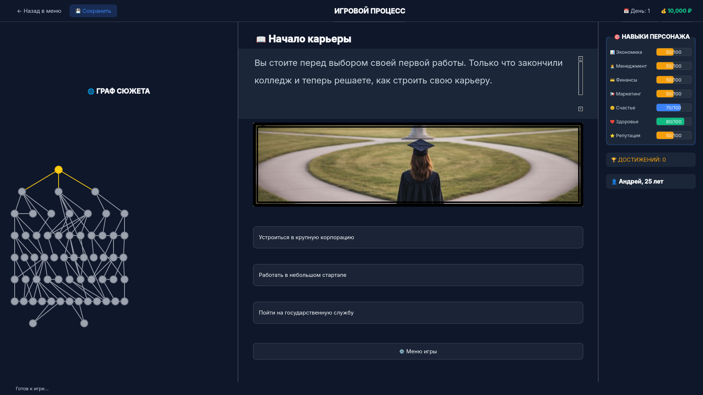
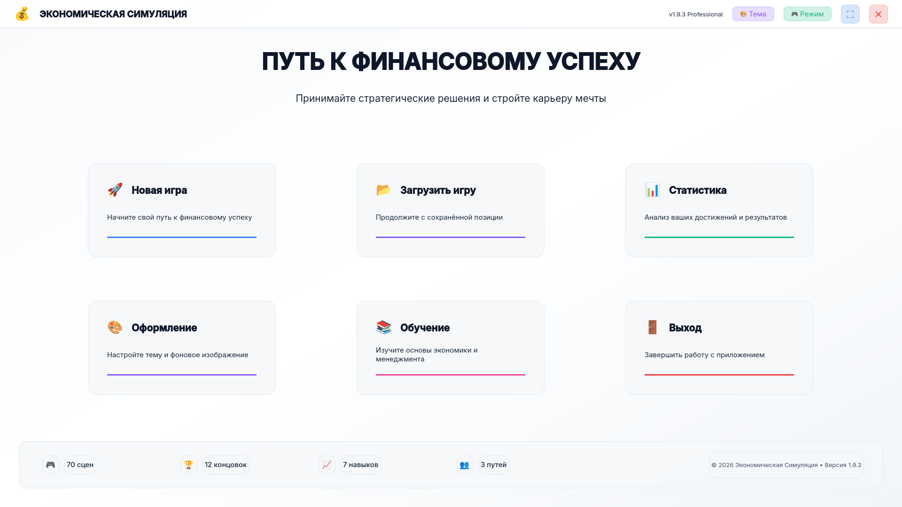
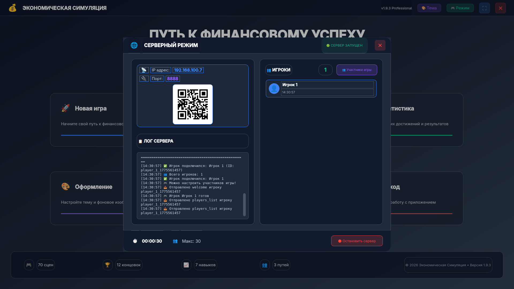
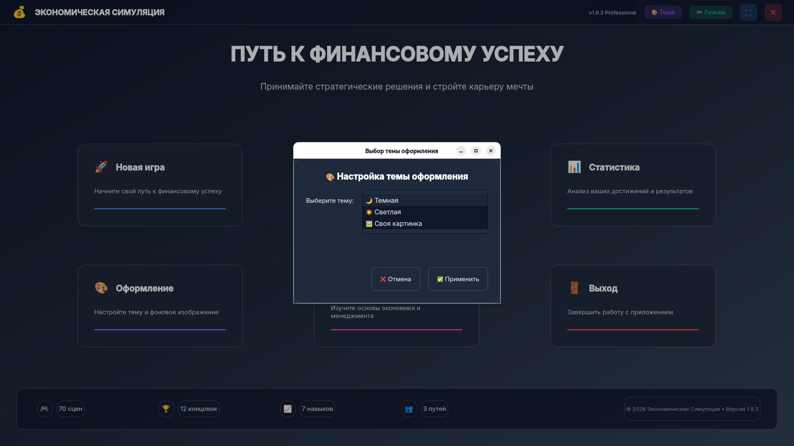
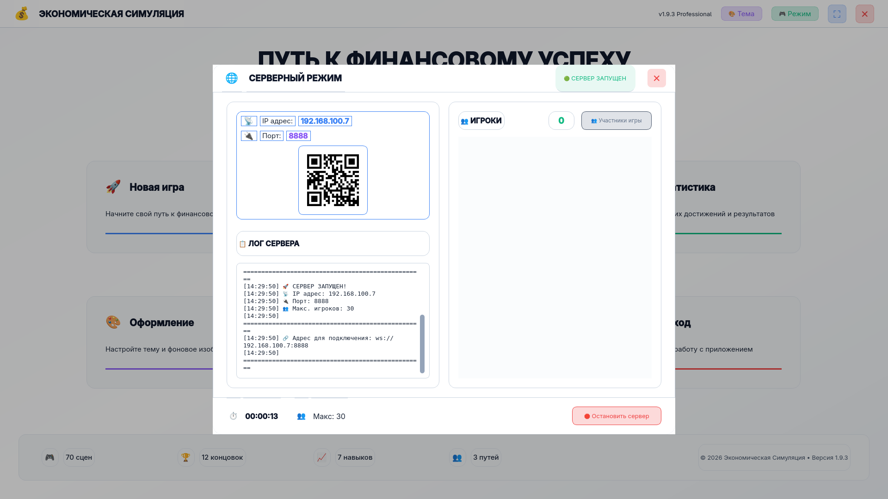

<div align="center">
  
# 💼 Экономическая Симуляция v1.9.3


> 🎮 Интерактивная экономическая RPG с мультиплеером  
> 📊 Система самооценки и взаимных оценок • Радарные графики • 3 темы оформления

</div>

---

## 📋 Оглавление
- [📖 О проекте](#-о-проекте)
- [✨ Возможности](#-возможности)
- [📸 Демонстрация](#-демонстрация)
- [📥 Установка и запуск](#-установка-и-запуск)
- [🎮 Использование](#-использование)
- [🛠 Технологии](#-технологии)
- [🎨 Темы оформления](#-темы-оформления)
- [🌐 Мультиплеер](#-мультиплеер)
- [📱 Другие платформы](#-доступно-на-других-платформах)
- [🔧 Решение проблем](#-решение-проблем)
- [📄 Лицензия](#-лицензия)
- [📬 Контакты](#-контакты-и-поддержка)

---

## 📖 О проекте

**Экономическая Симуляция** — это интерактивная RPG, где игроки проходят через серию сценариев, развивая навыки и принимая решения. С версии 1.9.0 проект обзавёлся полноценным мультиплеером с системой взаимных оценок и профессиональной визуализацией статистики.

### ✨ Возможности

| Фича | Описание |
|------|----------|
| 🎮 **2 режима игры** | Одиночный режим + Мультиплеер (до 30 игроков) |
| 📊 **Система оценок** | Самооценка + оценки других игроков по 7 категориям |
| 📈 **Визуализация статистики** | Радарные графики + столбчатые диаграммы + аналитика |
| 🎨 **3 темы оформления** | Тёмная, светлая, своя картинка на фон |
| 🌐 **WebSocket сервер** | Подключение с телефонов через QR-код |
| 💾 **Автосохранение** | Все результаты и статистика сохраняются между сессиями |
| 🧠 **Аналитические выводы** | Автоматический анализ сильных и слабых сторон |
| 🎯 **70 сценариев** | 12 уникальных концовок, 3 пути развития |

---

## 📸 Демонстрация

<div align="center">

| 🎮 Игровой процесс | 🖼️ Светлая тема |
|:------------------:|:-------------------:|
|  |  |
| *Прохождение сценариев* | *Адаптация под свет* |

| 🖥️ Серверный режим | 🎨 Выбор темы | 📱 QR-код |
|:------------------:|:-------------:|:---------:|
|  |  |  |
| *Список игроков + лог* | *3 варианта оформления* | *Быстрое подключение* |

</div>

---

## 📥 Установка и запуск

### ⚡ Быстрый старт

```bash
# 1. Клонируйте репозиторий
git clone https://github.com/Andrey3141/The-Life.git
cd The-Life

# 2. Установите зависимости
pip install -r requirements.txt

# 3. Запустите приложение
python main.py
```

### 📦 Требования
- Python 3.8 или выше
- pip (менеджер пакетов Python)
- Интернет (для QR-кода и WebSocket)

---

## 🎮 Использование

### 🎯 Главное меню

| Кнопка | Действие |
|--------|----------|
| 🎮 **Одиночный режим** | Начать игру в одиночку |
| 🌐 **Мультиплеер** | Запустить сервер для подключения игроков |
| 🎨 **Тема** | Выбрать тему оформления (тёмная/светлая/своя картинка) |
| 📊 **Статистика** | Просмотреть историю игр и рекорды |
| ❌ **Выход** | Закрыть приложение |

### 🎲 Игровой процесс

1. **Создание персонажа** — введите имя и возраст
2. **Прохождение сценариев** — выбирайте действия, развивайте навыки
3. **Самооценка** (мультиплеер) — оцените себя по 7 категориям
4. **Оценка других** — игроки оценивают друг друга
5. **Результаты** — радарные графики + аналитические выводы

### 📊 Категории оценки

| Категория | Описание |
|-----------|----------|
| 💼 **Профессионализм** | Знания и опыт в своей сфере |
| 🗣️ **Коммуникация** | Умение общаться и договариваться |
| 🧠 **Креативность** | Нестандартное мышление и идеи |
| ⚡ **Эффективность** | Скорость и качество работы |
| 🤝 **Командность** | Работа в коллективе |
| 📈 **Лидерство** | Умение вести за собой |
| 🎯 **Результативность** | Достижение поставленных целей |

---

## 🛠 Технологии

```
🐍 Python 3.8+        — основной язык
🪟 PySide6            — графический интерфейс (Qt)
🌐 WebSockets         — мультиплеерное взаимодействие
📷 qrcode + Pillow    — QR-коды и изображения
📊 Custom Widgets     — радарные и столбчатые графики
🎨 QSS + Градиенты    — стилизация интерфейса
```

---

## 🎨 Темы оформления

<div align="center">

| 🌙 Тёмная тема | ☀️ Светлая тема | 🖼️ Своя картинка |
|:--------------:|:---------------:|:----------------:|
| *Классическая* | *Для светлых помещений* | *Любое изображение* |
| Тёмный фон | Белый фон | Cover-масштабирование |
| Белый текст | Чёрный текст | Полупрозрачные карточки |

</div>

### 🎯 Особенности тем
- **Автосохранение** — выбранная тема запоминается
- **Адаптация всех элементов** — карточки, кнопки, диалоги
- **Cover-эффект** — картинка растягивается на весь экран с обрезкой
- **Полупрозрачные карточки** — контент всегда читаем на любом фоне

---

## 🌐 Мультиплеер

### 🖥️ Режимы работы сети

| Режим | Описание |
|-------|----------|
| 📡 **Общая Wi-Fi сеть** | Ноутбук подключён к роутеру |
| 📱 **Режим точки доступа** | Ноутбук раздаёт интернет |

### 📱 Подключение с телефона

1. Запустите **Мультиплеер** в главном меню
2. На телефоне отсканируйте **QR-код**
3. Откроется веб-страница с интерфейсом оценок
4. Оценивайте других игроков и себя

### 🛡️ Защита от DoS-атак
- Одно устройство = одно активное соединение
- Автоматическая очистка "мёртвых" соединений
- Валидация всех входящих сообщений

---

<div align="center">

## 📱 Доступно на других платформах

| 🖥️ Desktop (Python) | 📱 Android |
|---------------------|------------|
| [](https://github.com/Andrey3141/The-Life) | [](https://github.com/Andrey3141/The-Life-Android) |

</div>

> 📱 **Android-версия** — нативное приложение на Kotlin с тем же функционалом: прохождение сценариев, развитие навыков, множество концовок. Доступно в виде APK-файла.

---

## 🔧 Решение проблем

<details>
<summary>❌ Не запускается мультиплеер</summary>

1. Проверьте, что порт 8765 не занят другим приложением
2. Убедитесь, что брандмауэр не блокирует Python
3. В режиме точки доступа: проверьте, что телефоны в той же сети
4. Перезапустите приложение
</details>

<details>
<summary>❌ Не подключаются телефоны</summary>

1. Убедитесь, что телефоны в одной Wi-Fi сети с компьютером
2. Проверьте IP-адрес в окне сервера
3. Отсканируйте QR-код заново (он обновляется при смене режима)
4. Попробуйте ввести URL вручную: `http://[IP_сервера]:8765`
</details>

<details>
<summary>❌ Не отображаются графики в результатах</summary>

- Убедитесь, что были получены оценки от всех игроков
- Проверьте консоль на наличие ошибок импорта
- Перезапустите игру
</details>

<details>
<summary>❌ Проблемы с темой оформления</summary>

- Удалите `data/theme_config.json` для сброса
- Убедитесь, что выбранная картинка существует
- Поддерживаемые форматы: PNG, JPG, JPEG, BMP, GIF
</details>

---

## 🤝 Вклад в проект

Приветствуются PR и Issues! 🙌

1. Форкните репозиторий
2. Создайте ветку: `git checkout -b feature/your-feature`
3. Закоммитьте изменения: `git commit -m 'feat: add your feature'`
4. Отправьте: `git push origin feature/your-feature`
5. Откройте Pull Request

---

## 📄 Лицензия

<div align="center">

[](LICENSE)

Проект распространяется под лицензией **MIT**.  
См. файл [LICENSE](LICENSE) для подробностей.

</div>

---

<div align="center">

## 📬 Контакты и поддержка

> 💬 Есть вопрос, идея или нашли баг? Пишите!

[](https://github.com/Andrey3141)
[](https://t.me/tools271)
[](mailto:askackov08@gmail.com)

</div>

---

<div align="center">

## 🚀 Скачать приложение

> ⬇️ Готовый `.exe` для Windows (не требует установки Python)

[](https://github.com/Andrey3141/EconomicSimulation/releases/latest/download/EconomicSimulation.exe)

<small>🔗 Ссылка ведёт на последний релиз: [Releases](https://github.com/Andrey3141/EconomicSimulation/releases)</small>

---

### 📱 Скачать Android-версию

> ⬇️ Нативное приложение для Android на Kotlin

[](https://github.com/Andrey3141/The-Life-Android/releases/latest/download/app-debug.apk)

<small>🔗 Ссылка ведёт на последний релиз: [Releases](https://github.com/Andrey3141/The-Life-Android/releases)</small>

</div>

---

<div align="center">

### 🙏 Благодарности

- **The Qt Company** за PySide6 🪟
- **Команда websockets** за отличную библиотеку 🌐
- **Сообщество Python** за качественные инструменты 🐍
- **Всех тестировщиков** за помощь в отладке 🧪

---

**Экономическая Симуляция** — развивайте навыки с удовольствием! 🎉💼

*Сделано с ❤️ на Python и Kotlin*

</div>
